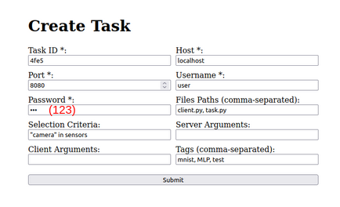

# AGATA - Arquitetura para Gerenciamento Automático de Tarefas de Aprendizado Federado 

O objetivo deste artefato é exemplificar o uso da ferramenta AGATA através de dois experimentos: 

* O primeiro experimento inicializa os microsserviços do servidor e, em seguida, cria e inicializa uma tarefa simples de aprendizado no servidor, executado na máquina local. Depois, ocorre a inicialização dos microsserviços do cliente na mesma máquina. Com isso, ocorre a trasferência automática da tarefa para o cliente.

* O segundo experimento se diferencia do primeiro ao inicializar uma tarefa com erro (E) e outra correta (C). O cliente, após ocorrer um erro em E, automaticamente troca a tarefa para C.

Em ambos os casos, os resultados são apresentados nos arquivos `experiments/events.json`, `experiments/exp_*_raw_times` e `logs_*/*`.

# Estrutura do README.md

<ul>
    <li><a href="#selos-considerados">Selos considerados</a></li>
    <li><a href="#informações-básicas">Informações básicas</a></li>
    <li><a href="#dependências">Dependências</a></li>
    <li><a href="#preocupações-com-segurança">Preocupações com segurança</a></li>
    <li><a href="#instalação">Instalação</a></li>
    <li><a href="#teste-mínimo">Teste mínimo</a></li>
    <li><a href="#experimentos">Experimentos</a></li>
    <li><a href="#license">LICENSE</a></li>
    <li><a href="#equivalencia">Equivalência de terminologias</a></li>
    <li><a href="#documentação">Documentação</a></li>
</ul>

# Selos considerados

Os 4 selos são considerados:

* Artefatos Disponíveis (SeloD);
* Artefatos Funcionais (SeloF);
* Artefatos Sustentáveis (SeloS); e
* Experimentos Reprodutíveis (SeloR).

# Informações básicas

Os experimentos foram executados em diferentes máquinas físicas e virtuais, com as seguintes especificações:
* VM com 4 CPUs, 8GB de memória RAM e Debian 12, instanciadas em um servidor com CPU Intel Xeon E5-2650, 8 núcleos e 16 threads, 2,80GHz e 32GB de RAM. 
* PC com Intel i9-10900, CPU de 2.80 GHz, 20 threads, 32GB de RAM, e Ubuntu 20.04.
* Notebook com Intel i5-8250U , CPU de 3.40 GHz, 8 threads, 8GB de RAM, e Ubuntu 20.04.

Uma vez que em todas as configurações não foi observada nenhuma dificuldade com desempenho, assume-se a execução é garantida sob as seguintes condições:
* Sistema Operacional Ubuntu 20.04 ou Debian 12
* CPU mínima: Intel i5 de 8ª Geração
* Memória mínima: 8GB

# Dependências

Os requisitos são:
* Python 3.12.7 
* Conda (miniconda3)
* Docker 24.0.7

# Preocupações com segurança

A execução dos experimentos não apresentam para os revisores riscos de segurança **conhecidos pelos autores**. Por prevenção, uma vez que alguns processos expõem portas de rede, recomenda-se a execução em uma rede local segura.

Em **casos de modificação do código por parte do usuário**, para além do tutorial apresentado neste artefato, os autores se isentam de riscos da segurança.

# Instalação

O tutorial a seguir apresenta a inicialização manual dos microsserviços. Entende-se que a execução desses comandos diretamente pelo usuário, sem um script automatizado, torna mais clara a arquitetura da AGATA. Entretanto, foram disponibilizados scripts mais automatizados para execução dos experimentos posteriores, simplificando bastante o processo de instalação. Todos os comandos devem ser executados a partir da raíz do repositório.

## Novo ambiente conda

Crie um ambiente conda:

```bash
conda create -n agata python=3.12.7
```

Ative o ambiente conda pela primeira vez:

```bash
conda activate agata
```

Instale as dependências dentro do ambiente conda:

```bash
conda install pip
pip install -r requirements.txt
```

## Arquivo de configuração

O arquivo `config.ini` deve ser configurado da seguinte forma:

```ini
[client.broker]
host=localhost
port=8000

[server.broker]
host=localhost
port=9000

[server.gateway]
port=9001

[events]
register_events=false

[client.params]
request_interval=10
```

## Inicialização do servidor

### Inicialize o broker

Antes de executar o comando, verifique se um contêiner com o nome `server-broker-rabbit` existe usando `docker ps`. Se existir, será necessário interrompê-lo e deletá-lo, executando:

```bash
sudo docker stop server-broker-rabbit
sudo docker rm server-broker-rabbit
```

O borker irá escutar na porta 9000 do hospedeiro. Então, verifique se não há outra aplicação na máquina usando a mesma porta. Em seguida, execute:

```bash
sudo docker run -d --hostname broker --rm --name server-broker-rabbit -p 9000:5672 rabbitmq:3
```

### Inicialize o gateway 

Abra um novo terminal, ative o ambiente (`conda activate agata`) e execute:

```bash
python3 -u -m cloud_gateway.http_gateway
```

### Inicialize o gerenciador de usuários

Abra um novo terminal, ative o ambiente (`conda activate agata`). Antes de executar o comando abaixo, apague o arquivo `user_manager/db/users.db` caso exista. Em seguida execute:

```bash
python3 -u -m user_manager.service_user_manager
```

### Inicialize o gerenciador de tarefas

Abra um novo terminal, ative o ambiente (`conda activate agata`). Antes de executar o comando abaixo, apague o arquivo `cloud_task_manager/db/tasks.db` caso exista. Em seguida execute:

```bash
python3 -u -m cloud_task_manager.service_cloud_ml
```

### Inicialize o servidor de donwload do gerenciador de tarefas

Abra um novo terminal, ative o ambiente (`conda activate agata`) e execute:

```bash
python3 -u -m cloud_task_manager.host_tasks $(pwd)/cloud_task_manager
```

## Inicialização do cliente

### Inicialize o broker

Antes de executar o comando, verifique se um contêiner com o nome `client-broker-rabbit` existe usando `docker ps`. Se existir, será necessário interrompê-lo e deletá-lo, executando:

```bash
sudo docker stop client-broker-rabbit
sudo docker rm client-broker-rabbit
```

O borker irá escutar na porta 9000 do hospedeiro. Então, verifique se não há outra aplicação na máquina usando a mesma porta. Em seguida execute:

```bash
sudo docker run -d --hostname broker --rm --name client-broker-rabbit -p 8000:5672 rabbitmq:3
```

### Inicialize o gateway 

Abra um novo terminal, ative o ambiente (`conda activate agata`) e execute:

```bash
python3 -u -m client_gateway.amqp_gateway 
```

### Inicialize o gerenciador de tarefas 

Abra um novo terminal, ative o ambiente (`conda activate agata`). Este é o gerenciador de tarefas do cliente! Não é o mesmo inicializado no servidor previamente. Antes de executar o comando a seguir, delete todos os arquivos dentro dos diretórios `client_task_manager/tasks/` e `client_task_manager/client_info/`, caso existam. O primeiro diretório contém as tarefas que o cliente baixou do servidor, e o segundo contem informações do cliente usadas para identificá-lo e listar estatísticas. **Não apague os diretórios** `client_task_manager/tasks/` e `client_task_manager/client_info/`. Apague todos os arquivos e diretórios **dentro** destes diretórios. Em seguida execute: 

```bash
python3 -u -m client_task_manager.service_client_ml
```

Neste momento, o cliente começará a enviar requisições para o servidor para:
* Registrar suas informações
* Pedir tarefas para baixar, caso estejam disponíveis

# Teste mínimo

O teste mínimo depende da inicialização manual, descrita na seção anterior.

## Execução de uma tarefa

### Acesse a interface gráfica

Em um novo terminal, execute o comando a seguir e abra o navegador web local na porta 9999 para acessar uma interface web de interação com o ambiente em nuvem.

```bash
python3 -m http.server -d cloud_web_interface 9999
```

### Registre a tarefa

Clique no link `Create task` e preencha os campos do formulário conforme a imagem abaixo.

Após clicar em `Submit`, o gerenciador de tarefas em nuvem irá registrar uma nova tarefa em seu banco de dados. Os arquivos desta tarefa encontram-se em `cloud_task_manager/tasks/task_4fe5/*`. O upload dos arquivos poderia ser feito acessando a opção `Upload task files` no menu inicial, mas este passo foi omitido por simplicidade.



### Inicie a tarefa no servidor

No menu iniciar, clique no link `Start task`, fornece o ID anteriormente adicionado (`4fe5`) e deixando o campo de argumentos vazio. Ao submeter o formulário, a tarefa deve ser iniciado no gerenciador de tarefas em nuvem. Neste momento, o gerenciador de tarefas do cliente deve baixar a tarefa e iniciá-la. 

### Inicie um segundo cliente de teste

O servidor da tarefa é configurado para depender de dois clientes no mínimo para avnaçar as rodadas. Assim, iremos iniciar diretamente um novo processo Flower. 
Abra um novo terminal, ative o ambiente (`conda activate agata`) e execute:

```bash
python3 -u -m cloud_task_manager.tasks.task_4fe5.client cli
```

A tarefa deve progredir ao longo de apenas uma rodada. Ao finalizá-la, deve ser ressaltado que, automaticamente, a tarefa se torna inativa no cliente e no servidor, podendo ser disparada novamente pela interface de iniciar tarefa. 

## Finalização

Após o teste mínimo, os serviços podem ser interrompidos (Ctrl + c), bem como os brokers (`docker stop [nome_do_contêiner] ; docker rm [nome_do_contêiner]`). O ambiente pode ser desativado (`conda deactivate`).

# Experimentos

Os experimentos são executados por scripts automatizados. Antes de executar o primeiro experimento, garanta a finalização de qualquer processo Python anteriormente iniciado neste artefato. Não se preocupe que contêineres serão finalziados e os bancos de dados serão deletados pelos scripts dos experimentos. O mais importante é que nenhum micorsserviço Python esteja iniciado, para evitar conflitos de porta de rede, por exemplo.

## Modificações nas configurações

Modifique a seguinte linha do arquivo `config.ini`:

```ini
[events]
register_events=ture
```

## Experimento 1 

Para executar o primeiro experimento, descrito no início deste artefato, execute

```bash
conda activate agata
bash experiments/exp1.sh
```

A permissão de superusuário será pedida para executar o Docker. O experimento demora certa de 4 minutos. O revisor pode acompanhar no terminal a impressão do andamento do experimento. Detalhes sobre o experimento são encontrados no artigo. O registro e a inicialização de tarefas ocorre por linha de comando, ao invés de interface gráfica. Os resultados mais interessantes são:
* O arquivo `experiments/events.json` apresenta, em ordem de momento de execução, as principais etapas necessárias para a execução da tarefa de aprendizado federado, bem como a estampa de tempo correspondente e o componente onde ocorrem
* O arquivo `experiments/exp1_raw_times` resume o tempo para as operações mais importantes

## Experimento 2

Para executar o primeiro experimento, descrito no início deste artefato, execute

```bash
conda activate agata
bash experiments/exp2.sh
```

Analogamente, observe os arquivos `experiments/events.json` e `experiments/exp2_raw_times`

# LICENSE

```
MIT License

Copyright (c) 2024 Grupo de Teleinformática e Automação (GTA)

Permission is hereby granted, free of charge, to any person obtaining a copy
of this software and associated documentation files (the "Software"), to deal
in the Software without restriction, including without limitation the rights
to use, copy, modify, merge, publish, distribute, sublicense, and/or sell
copies of the Software, and to permit persons to whom the Software is
furnished to do so, subject to the following conditions:

The above copyright notice and this permission notice shall be included in all
copies or substantial portions of the Software.

THE SOFTWARE IS PROVIDED "AS IS", WITHOUT WARRANTY OF ANY KIND, EXPRESS OR
IMPLIED, INCLUDING BUT NOT LIMITED TO THE WARRANTIES OF MERCHANTABILITY,
FITNESS FOR A PARTICULAR PURPOSE AND NONINFRINGEMENT. IN NO EVENT SHALL THE
AUTHORS OR COPYRIGHT HOLDERS BE LIABLE FOR ANY CLAIM, DAMAGES OR OTHER
LIABILITY, WHETHER IN AN ACTION OF CONTRACT, TORT OR OTHERWISE, ARISING FROM,
OUT OF OR IN CONNECTION WITH THE SOFTWARE OR THE USE OR OTHER DEALINGS IN THE
SOFTWARE.
```

# Equivalência de terminologias

| Artigo (PT)    | Código (EN) |
| ------------------------ | ------------------ |
| Gerenciador de tarefas em nuvem | Cloud task manager|
| Gerenciador de tarefas embarcado | Client task manager|
| Gateway do client | Client gateway |
| Gateway em nuvem | Cloud gateway |
| Gerenciador de clientes | User manager |
| Aplicação de gerenciamento | Cloud web interface |
| MicrosserviçoBase | BaseService |
| Biblioteca de Suprocessos Flower (BSF) | Flower Task Daemon Lib (FTDL) |
| bsf.Mensageiro | task_reporter.TaskReporter |
| msg.envia_info | task_reporter.send_info |
| msg.dispara_gatilho | task_reporter.trigger |
| msg.envia_erro | task_reporter.send_error |
| ClienteRPC | RpcClient |
| atualiza_info | rpc_exec_update_info |
| lê_info_cliente | rpc_exec_get_user_info |
| cria_tarefa | rpc_exec_create_task |
| inicia_tarefa | rpc_exec_start_server_task |
| pede_tarefa | rpc_exec_client_requesting_task |
| download_cod | download_file |

# Documentação

```bash
cd docs
sphinx-build -M html source build
python3 -m http.server -d build/html 7777
```

Acesse `http:\\localhost:7777` para visualizar a documentação no formato Sphinx
